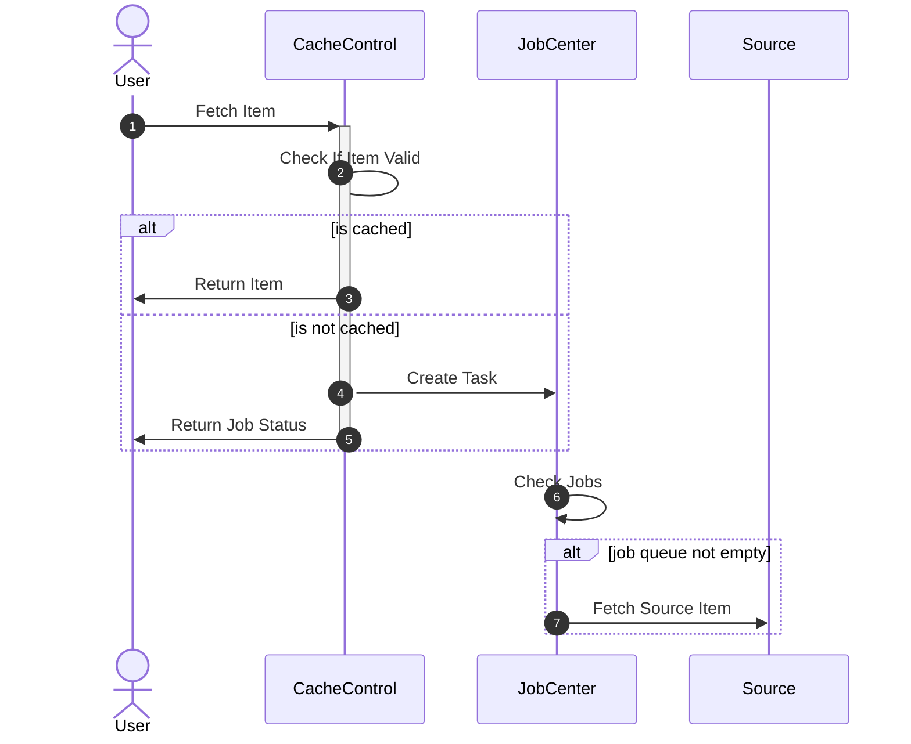

```mermaid
sequenceDiagram
    autonumber
    actor U as User
    participant C as CacheControl
    participant J as JobCenter
    participant S as Source
    U->>+C: Fetch Item
    C->C: Check If Item Valid
    alt is cached
        C->>U: Return Item
    else is not cached
        C->>J: Create Task
        C->>-U: Return Job Status
    end
    J->>J: Check Jobs
    alt job queue not empty
        J->>S: Fetch Source Item
    end
```
